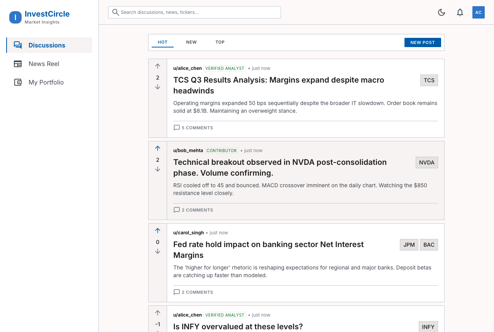
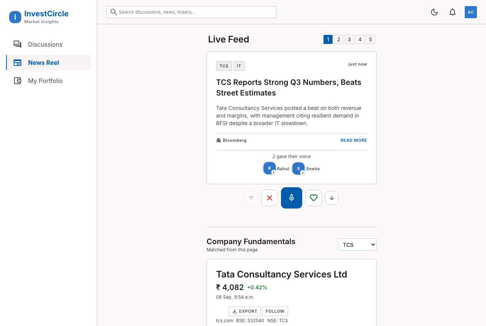
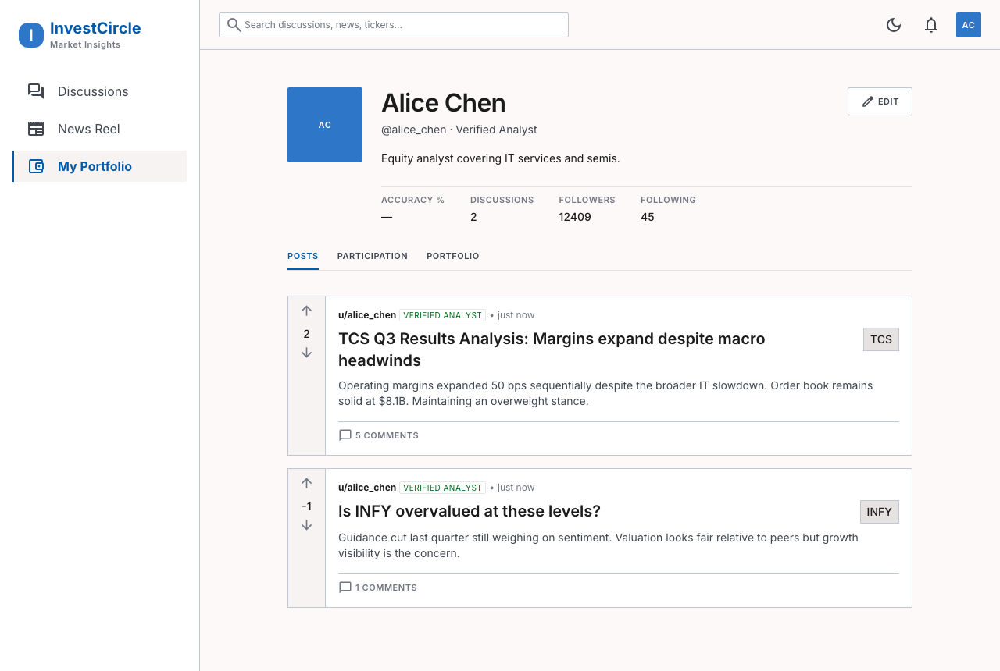

# InvestCircle

InvestCircle is a peer-to-peer stock research and community platform — a place for retail investors to discuss stocks, follow market news, and track their own portfolio, all in one clean, dashboard-style app.

This is a college Software Engineering group project. It is a working prototype/demo built to showcase the core product experience end-to-end, not a production trading or brokerage system — it does not execute trades or connect to any real brokerage or bank account.

## Features

- **Discussions** — a Reddit-style stock discussion board with upvotes/downvotes, threaded comment replies, and per-comment reactions (insightful / flame). Sort by Hot, New, or Top.
- **News Reel** — a swipeable, Instagram-Reels-style market news feed. Read More opens the full article. Users can react to a story by recording a real camera/mic voice note, tagging it Bullish or Bearish, and adding a text comment — reactions play back in a full-screen, Stories-style viewer with like/bullish/bearish reactions.
- **Portfolio** — a personal portfolio page with real holdings (buy date, buy price, quantity), live P&L per holding, and per-currency summary cards (total corpus, total invested, absolute return, 1Y/5Y average return).
- **Company Fundamentals** — a fundamentals panel (price, market cap, P/E, book value, dividend yield, ROE/ROCE, growth tables) that dynamically follows whichever company the news story, post, or discussion is about.
- **Auth** — email/password signup and login, sessions via an HTTP-only cookie.
- **Light and dark mode**, toggleable from the top bar.

## Tech stack

| Layer     | Choice                                                              |
| --------- | -------------------------------------------------------------------- |
| Frontend  | React + Vite, Tailwind CSS, React Router — plain JavaScript, no TypeScript |
| Backend   | Node.js + Express, plain JavaScript                                  |
| Database  | SQLite via `better-sqlite3` — a single file, raw SQL, no ORM          |
| Auth      | bcrypt password hashing + JWT stored in an HTTP-only cookie          |

Kept deliberately simple: no ORM, no state-management library, no microservices/Docker/CI — a two-folder app (`frontend/`, `backend/`) that any of the four teammates can read end to end.

## Screenshots

| Discussions | News Reel | Portfolio |
| --- | --- | --- |
|  |  |  |

## Getting started

Requires Node.js 18+.

```bash
# 1. Backend — API + SQLite database
cd backend
npm install
node seed.js      # creates investcircle.db and seeds demo data
npm start          # runs on http://localhost:4000

# 2. Frontend — in a second terminal
cd frontend
npm install
npm run dev         # runs on http://localhost:5173
```

Then open `http://localhost:5173`.

### Demo accounts

Seeded by `node seed.js`, all with password `password123`:

- `alice@investcircle.dev`
- `bob@investcircle.dev`
- `carol@investcircle.dev`

## Project structure

```
InvestCircle/
  frontend/            React + Vite app
  backend/             Express API + SQLite (schema.sql, seed.js, routes/)
  design-reference/    Original Stitch UI export — reference only
  docs/                Build notes and phase plan for this project
  journals/            Per-teammate weekly dev journals
```

## Known limitations (by design, for a prototype)

- No real market-data feed — prices and fundamentals are seeded demo data (clearly labeled in the UI).
- The JWT signing secret is a hardcoded dev value — fine for a local demo, not meant for a real deployment.
- No password reset, email verification, or rate limiting.

## Team

| Name | Roll No. | Role |
| --- | --- | --- |
| Lakshay Sachdeva | 1024160104 | Full-Stack Developer & Team Lead |
| Anirudh Phophalia | 1024160120 | Backend Engineer |
| Ishan Jha | 1024160099 | Frontend Engineer |
| Aarav Kumar Arora | 1024160106 | UI/UX Designer & QA |

## License

See [LICENSE](LICENSE).
